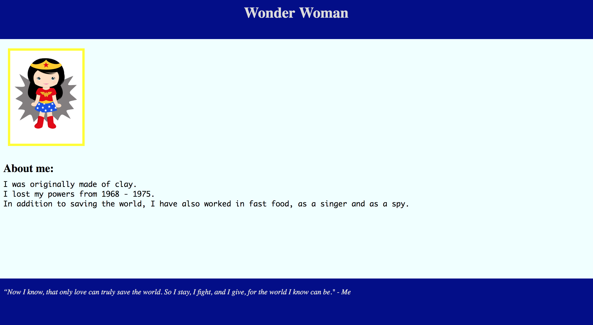

# Prime Tier 1 Week 1

Welcome to Tier 1 at Prime Digital Academy! In week 1, we're getting you set up with the basics.

Click the link below to set up Atom:

- [Atom (our IDE - Integrated Development Environment)](atom.md)

This will take some time and will require installing some programs on your Mac. So, get started early in the week and spread the work throughout.

---

#### Now, for your first assignment!

## Topics Covered

For the assignment this week, you will step through the process of:

* using git to fork/clone repositories from GitHub and getting your work published to your GitHub account
* setting up files and connecting them
* testing your work in the browser
* using the command line and your Mac's built-in Terminal
* turning your assignment in through Prime's Assignment Portal

## Assignment

**Note**: Please watch all the videos for Week 1 on [the Tier 1 site](http://fullstack.primeacademy.io) before starting the assignment. These videos contain important information that will help you complete the assignment. Feel free to refer back to these videos whenever you need them.

### 1 | Create a folder for your work
We recommend you create a dedicated folder for your Prime Tier 1 assignments. Call your folder something like *tier1*. For step-by-step instructions, check out the Week 1 videos, or take a look at the Step 1 [extended instructions](extended-instructions.md). You can clone your assignment repos into this folder (more on this in the next step).

### 2 | Getting the assignment onto your computer

[Watch this video on how to fork and clone](https://vimeo.com/218468543) the assignment into the *tier1* folder you created. You can also read the written instructions [here](extended-instructions.md) (look for Step 2). 

**Note:** The video may call the folder `prework`, but you can call your folder anything you want.

### 3 | Opening your assignment in Atom

**Option 1: Command Line Instructions**
1. In the Terminal, type `atom .` to open up your current directory in Atom. 
- If this doesn't work, take a look at [these instructions](https://stackoverflow.com/questions/22390709/how-to-open-atom-editor-from-command-line-in-os-x/23666354#23666354) to install this command.
- Or, take a look at the "Install Shell Commands" section of the Atom document linked at the beginning of these instructions.

**Option 2: From Atom Instructions**
1. Open Atom.
2. Select File > Open from the main menu and browse to the *prime-pw-week-1-assignment* folder to open. You'll see your folder listed in the left panel in Atom.

### 4 | Completing your assignment (base functionality)

Inside of project you just opened in Atom, is an *assignment* folder.

Inside of this folder, we've provided you with a few files, some of those files are inside of other folders.

**IMPORTANT:** Don't edit any files other than those inside of the *assignment* folder, and you should not need to move files around inside the folder.

#### Files Provided

- *assignment/index.html* (base functionality - required)
- *assignment/helloWorld.js* (base functionality - required)
- *assignment/style.css* (base functionality - required)
- *assignment/checkpoints/terminal.txt* (base functionality - required)

#### 4.1 | Editing your index.html file

Inside of the `index.html` file are comments with tasks for you to complete. Write the code below the comment (no need to delete the comment), like this:

```HTML
<!-- Create a header with an h1 containing your name -->

<header>
  <h1>Your Name Here</h1>
</header
```

- Feel free to add more content than just what is in the comments (but the content laid out in the comments is required)!

#### 4.2 | Add styling to the style.css file

Now that we have content in our HTML file, let's make it look nice with some styling!

- Similarly to the comments in your index.html file, there are comments in the styles.css file. You can write your styles below the comments.

- You can also add more styles if you want, but make sure you include the styles in the directions, those are required!

- Link your styles to your index.html file in the `head` of your HTML. Using a `<link>` tag (type `link` in your HTML and hit `enter`, Atom will create the tag for you), change the `href` to match the path to your CSS file. (Take a look [here](https://www.w3schools.com/tags/tag_link.asp) for more information).

- Here is an example of what your assignment could look like: 

#### 4.3 | Checking your work

Open your index.html file in Chrome. You should see all of the content you created in your HTML file, with the styles you created in your CSS file.

For step-by-step instructions, check out this week's video content or look [here](extended-instructions.md) (look for Step 4.3).

#### 4.4 | Complete the checkpoints

1. Show your instructors what you know! In the `checkpoints` folder, you will find a `terminal.txt` file.
2. In the `terminal.txt` file, there are questions about the terminal, which we learned about in the video content for this week. Below each question, all you need to do is type your answer! If you're unsure, feel free to do some research, or write that you're not sure. All we're asking for is you try your best! 

### 5 | Hello World! 

Our assignment also contains a `helloWorld.js` file. A "hello world" is a common first step in learning to code, and the first program many programmers write.

In the video for this week, we use a `console.log()` to get messages from our JavaScript file to display in the browser's console.

1. You will need to source in the `helloWorld.js` file into your `index.html` file.

2. Refer back to the video to cover how to source in and get "hello world" to log in the browser console for your assignment! More information on `console.log` can be found [here](https://www.w3schools.com/jsref/met_console_log.asp).

3. Be sure to test your work by opening your browser console for this assignment.

4. "Upload" these changes to GitHub (the same way you did in step 5).

### 6 | "Uploading" your changes to GitHub

Now that your assignment is done, we'll use Git to post your work to GitHub.

You can find detailed instructions on how to do this in this week's video content, or written instructions [here](extended-instructions.md) (look for Step 5).

### 7 | Turning in our work through the Assignment App

Watch the [detailed video instructions](https://vimeo.com/199694700). If needed, you can also reference the written instructions [here](extended-instructions.md) (look for Step 6).

### 8 | Answer Slack Discussion Question
Make sure that you answer this week's Slack discussion question (found each week in the left sidebar of the Tier 1 site) in your cohort's Slack channel!

