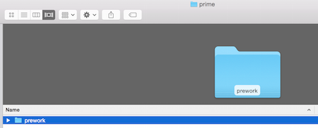
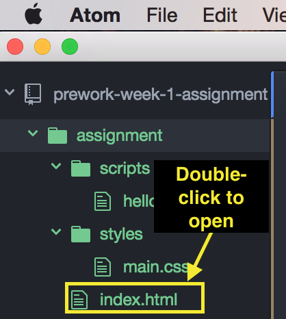
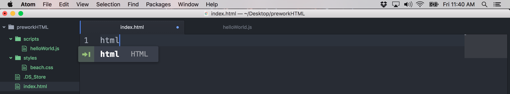
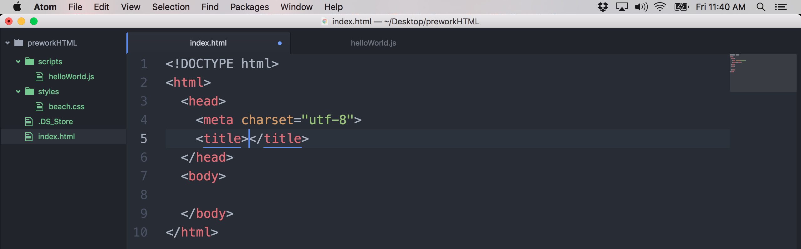
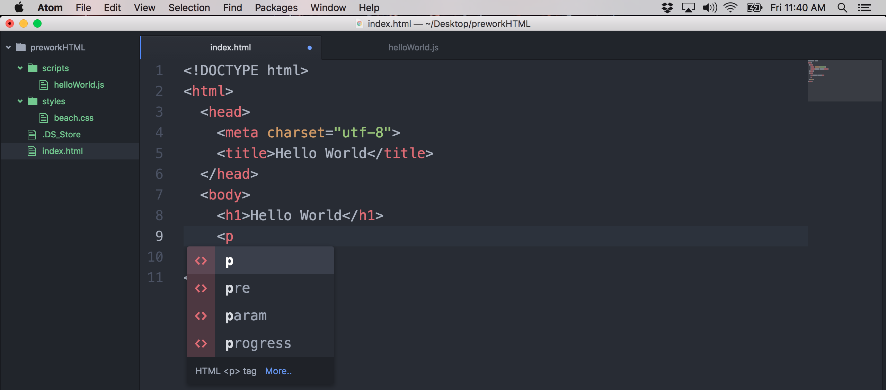
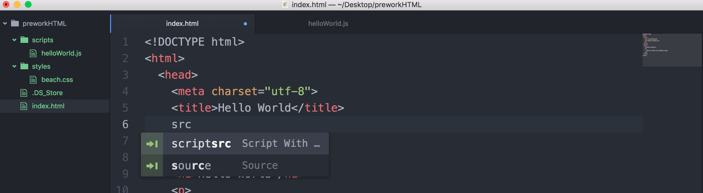
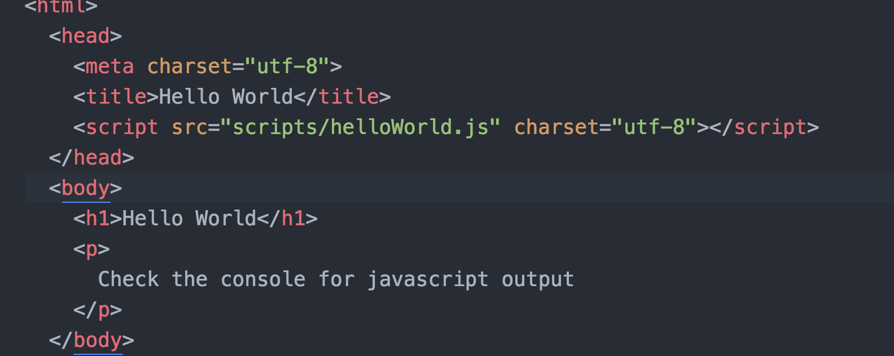
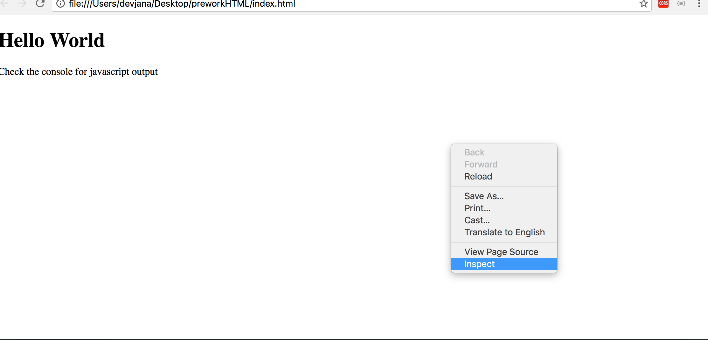
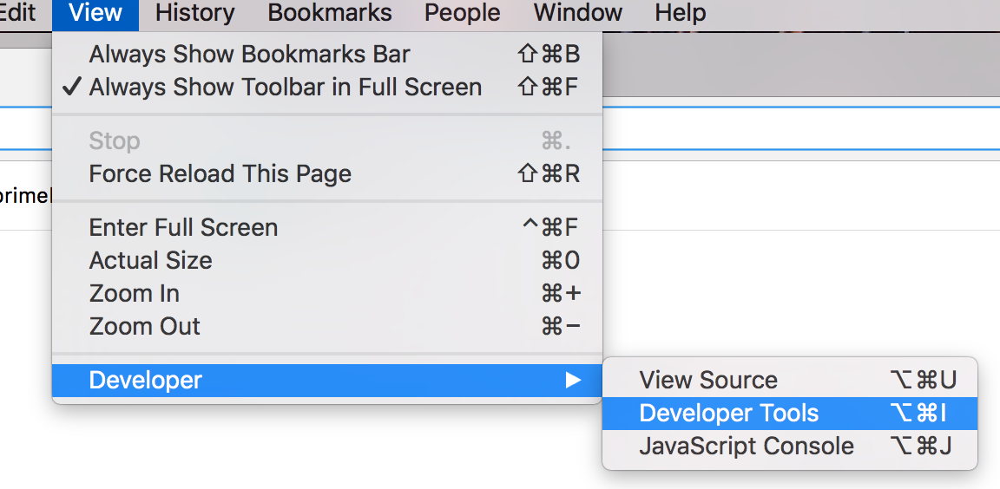
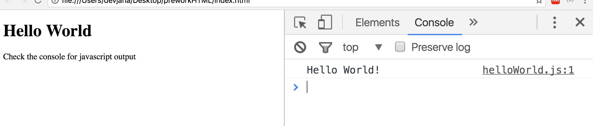

# Prime Prework Week 1

Welcome to Prework at Prime Digital Academy! In week 1, we're getting you set up with the basics.

Click on each link below for instructions:

- [ ] [Slack (our chat program)](slack.md)
- [ ] [Atom (our IDE - Integrated Development Environment)](atom.md)

This will take some time and will require installing some programs on your Mac. So, get started early in the week and spread the work throughout.

Now, for your first assignment!

## Topics Covered

For the assignment this week, you will step through the process of:

* setting up a simple page with JavaScript
* posting it to the Internet
* using your Mac's built-in Terminal to navigate through folders, open files, and post your work
* turning it in through Prime's Assignment App

## Assignment

Let's make a web page with some JavaScript using our new IDE, Atom!

### 1 | Creating folders for our work
We recommend you create dedicated folders for your Prime prework assignments. Follow the instructions below to do so:

Step | Instruction | Screen Shot
--- | --- | ---
1 | Open the Finder application. | 
2 | Select Go > Home from the menu. | 
3 | Select File > New Folder to create a *prime* folder for Prime work | 
4 | Type `prime` and hit the RETURN (or ENTER) key to name the new folder. |
5 | Double-click on the *prime* folder to open it. | *intentionally blank* :ok:
6 | Create a *prework* folder inside of the *prime* folder. **HINT:** Just like we did in Step 3 and 4. |

### 2 | Getting our assignment onto our computer

[Watch this video on how to "download"](https://vimeo.com/218468543) your assignment into the *prework* folder you created. The password for the video is '**pr1me**'. You can also read the written instructions below:

1. Click on the *Fork* button in the upper right-hand corner of this webpage.
2. Click to select your GitHub account in the modal window that appears. This will create a copy of this code under your account.
**NOTE:** You will immediately be navigated to your copy on GitHub.
3. Click on the green *Clone or download* button.
4. Click on the clipboard icon button to copy the Git URL for this repo.
5. Open the Terminal application on your computer. This can be found in Applications > Utilities > Terminal.


6. Type `cd ~/prime/prework` in the Terminal application and press the RETURN (or ENTER) key to navigate to your prework folder.
7. Type `git clone `. **IMPORTANT:** Leave a space after the word "clone".
8. Press COMMAND and V keys at the same time to paste your Git URL next to the words you just typed.
9. Press the RETURN (or ENTER) key to execute the typed command. This will create a local copy of your GitHub-hosted repo.
10. Type `cd prime-pw-1-assignment` to navigate into your local Git repo.

### 3 | Opening our project in Atom

**Option 1: Command Line Instructions**
1. In the Terminal, type `atom .` to open up your current directory in Atom.

**Option 2: From Atom Instructions**
1. Open Atom.
2. Select File > Open from the main menu and browse to the *prime-pw-week-1-assignment* folder to open. You'll see your folder listed in the left panel in Atom.

### 4 | Creating our web app

Inside of our project, is an *assignment* folder.

Inside of this folder, we've provided you with a few files, some of those files are inside of other folders.

**IMPORTANT:** Don't edit or worry about any files other than those inside of the *assignment* directory.

#### Files Provided

- [ ] *index.html*
- [ ] *scripts/helloWorld.js* (*helloWorld.js* is inside of the *scripts* folder)
- [ ] *styles/main.css*
- [ ] *checkpoints/terminal.txt*
- [ ] *checkpoints/htmlcss/index.html*
- [ ] *checkpoints/htmlcss/style.css*

#### 4.1 | Editing our index.html file

Now, let's get into our HTML file.

Step | Instruction | Screen Shot
--- | --- | ---
1 | Open *index.html* by double-clicking on its name in the left sidebar. | 
2 | Type in `html` and you'll see that Atom anticipates that you are trying to create an HTML file. |
3 | Press the TAB key and you'll see that Atom gives you some scaffolding for a basic HTML page. |
4 | Let's give our page a `title` of "Hello World" and add a `h1` in the body as well. |
5 | You may have noticed that Atom tries to anticipate what you are trying to add. This is because Atom knows it is an HTML file. Add a p tag by typing `p` and press TAB. Note that Atom finishes the opening tab as well as provides you with the closing p tag. |
6 | Give this paragraph tag some text content: "Check the console for JavaScript output". | *intentionally blank*

#### 4.2 | Editing our JavaScript file

1. Open *helloWorld.js*.
2. Add the following lines:

```javascript
function sayHello() {
  console.log('Hello World!');
}

sayHello();
```

This will display in a part of the browser called the console. We'll see this shortly.

#### 4.3 | Connecting our JavaScript and HTML

We'll need to "source" the *.js* file in the HTML. This is what connects the JavaScript to the HTML. This is similar to how you used `link` previously to add CSS to an HTML file.

1. In the `head` section of the HTML, start typing `src` and Atom will anticipate you sourcing in a script file.

2. "Source" in our js file as follows:

3. Save all your work and let's get ready to see how things are working!

#### 4.4 | Checking our work

Step | Instruction | Screen Shot
--- | --- | ---
1 | Open the *index.html* file in Chrome. **NOTE:** There are a few ways to do this, but one way is to type and execute `open assignment/index.html` in the Terminal. | *intentionally blank*
2 | Right-click anywhere on the webpage and choose Inspect from the popup menu. |
2 (alt) | Alternatively, this can also be opened by choosing View > Developer > Developer Tools. |
3 | In the Dev Tools panel, click on the "Console" tab to activate it. You'll see in there your "Hello World!" message. |

#### 4.5 | Add some styling

1. Add CSS styles to *styles/main.css*.
2. Link it into your *index.html*.

#### 4.6 | Complete the checkpoints

1. Show your instructors what you know! In the `checkpoints` folder, you will find two .txt files. These have some questions about things we have covered this week!
2. Below each question, all you need to do is type your answer! If you're unsure, feel free to do some research, or write that you're not sure. All we're asking for is you try your best!

### 5 | "Uploading" your changes to GitHub

You've now sourced in a JavaScript file and created a basic page that says hello to the world from you as a developer! Next, we'll use Git to post your work to GitHub.

**IMPORTANT:** All of the following steps will occur in Terminal.

1. Type `git add .` and press the RETURN (or ENTER) key. This tells Git that you want to stage your file updates.
2. Type `git commit -m "completed prework 1 assignment"` and press the RETURN (or ENTER) key. This creates a snapshot of your changes (a commit) that can be referenced later.
3. Type `git push -u origin master` to send your updates to GitHub.

### 5 | Turning in our work through the Assignment App

Watch the [detailed video instructions](https://vimeo.com/199694700). If needed, you can also reference the written instructions below:

1. Go to https://primeacademy.io/student.
2. Login with your email address and password. You will see a dashboard with your assignments.
3. Click on the **Prework Week 1** link. A form will appear in a modal window.
4. In a new browser tab, go to the repo for your completed assignment.
5. Copy the URL in the browser bar.
6. Return to the browser tab from Step 3.
7. Paste your URL into the **Git Repo** input field.
8. Optionally, add any comments you'd like to make to instructors in the **Comments** input field.
9. Click the **Save** button to complete submission of the assignment.

