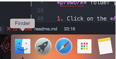
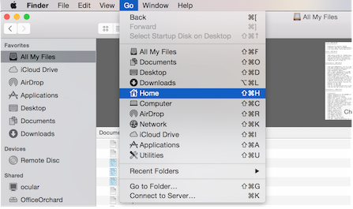
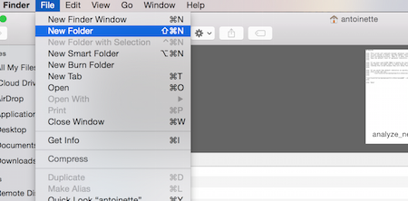
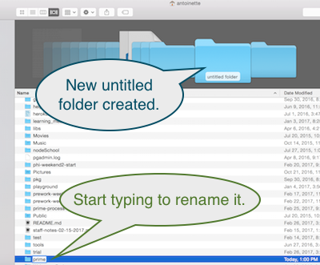
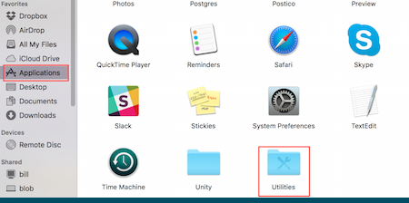
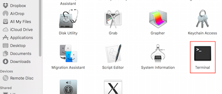

*Note*: There are not instructions in this file for every step of the assignment. 

### Step 1:

Step | Instruction | Screen Shot
--- | --- | ---
1 | Open the Finder application. | 
2 | Select Go > Home from the menu. | 
3 | Select File > New Folder to create a *prime* folder for Prime work | 
4 | Type `prime` and hit the RETURN (or ENTER) key to name the new folder. |
5 | Double-click on the *prime* folder to open it. | *intentionally blank* :ok:
6 | Create a *tier1* folder inside of the *prime* folder. **HINT:** Just like we did in Step 3 and 4. |

### Step 2:

1. Click on the *Fork* button in the upper right-hand corner of this webpage.
2. Click to select your GitHub account in the modal window that appears by clicking on your profile picture. This will create a copy of this code under your account.
**NOTE:** You will immediately be navigated to your copy on GitHub.
3. Click on the green *Clone or download* button.
4. Click on the clipboard icon button to copy the Git URL for this repo.
5. Open the Terminal application on your computer. This can be found in Applications > Utilities > Terminal.

6. Type `cd ~/prime/tier1` in the Terminal application and press the RETURN (or ENTER) key to navigate to your tier1 folder. **NOTE**: If you named your folders differently than `prime` and `tier1`, you will have to change the above command to match the names of your folders.
7. Type `git clone `. **IMPORTANT:** Leave a space after the word "clone".
8. Press COMMAND and V keys at the same time to paste your Git URL next to the words you just typed.
9. Press the RETURN (or ENTER) key to execute the typed command. This will create a local copy of your GitHub-hosted repo.
10. Type `cd prime-pw-week-1-assignment` to navigate into your local Git repo.

### Step 4.3:

1. Open the *index.html* file in Chrome. **NOTE:** There are a few ways to do this, but one way is to type and execute `open assignment/index.html` in the Terminal. | *intentionally blank*

### Step 5:

**IMPORTANT:** All of the following steps will occur in Terminal. Before doing the steps below, type `pwd` and RETURN (or ENTER). A file path will display in the terminal. The end of the path should say `prime-pw-week-1-assignment`. If it doesn't, navigate to the folder containing this week's assignment.

1. Type `git add .` and press the RETURN (or ENTER) key. This tells Git that you want to stage your file updates.
2. Type `git commit -m "completed week 1 assignment"` and press the RETURN (or ENTER) key. This creates a snapshot of your changes (a commit) that can be referenced later.
3. Type `git push -u origin master` to send your updates to GitHub.

### Step 7:

1. Go to https://primeacademy.io/student.
2. Login with your email address and password. You will see a dashboard with your assignments.
3. Click on the **Tier 1-Week 1** link. A form will appear in a modal window.
4. In a new browser tab, go to the **GitHub repo** for your completed assignment.
5. Copy the URL in the browser bar.
6. Return to the browser tab with the Prime assignment app.
7. Paste your URL into the **Git Repo** input field, don't worry about the `site` input field for now, you can leave it blank.
8. Optionally, add any comments you'd like to make to instructors in the **Comments** input field.
9. Click the **Save** button to complete submission of the assignment.
