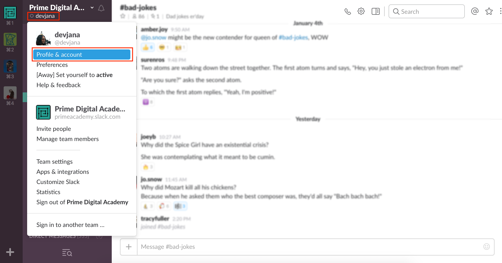
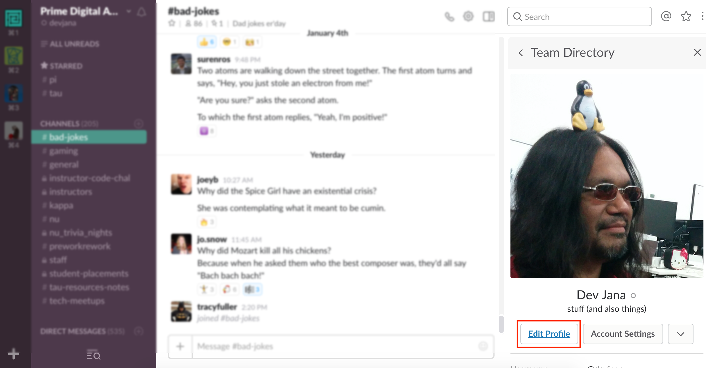
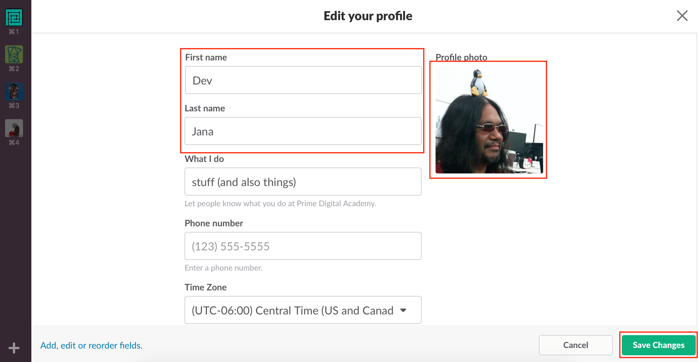
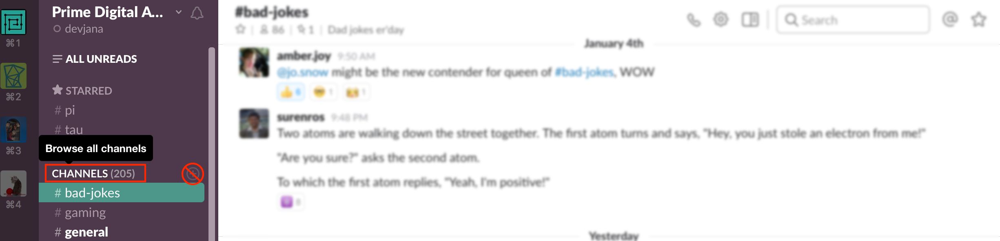
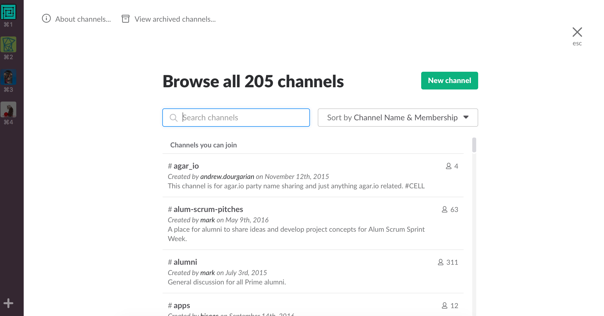

# Chatting with Slack

Slack is a super popular chat program within the industry and you will find it ubiquitous throughout your time at Prime. Getting comfortable with using Slack is incredibly important and you'll want to make its regular use a habit ASAP.

You should have already been invited to the Slack Channel for your cohort and we recommend you install the slack app: https://slack.com/downloads/

**NOTE:** There is also a Slack app for mobile devices!

## Setting up your profile
Make sure you set up your profile correctly. Once logged in, click on your user name and select "Profile & Account" from the popup menu.

Next, click "Edit Profile" in the profile overview.

Everyone should use their actual first and last name and a relatively recent pic of themselves for their profile.

## Exploring channels
There are many channels other than the one for your cohort. Take a few moments to browse them by clicking the word "Channels" (not the + next to channels). You can subscribe to any of the public channels at Prime.

You can also "star" channels that are high priority for you. If you subscribe to multiple channels, we highly recommend you star your cohort's channel.

Please, feel free to jump in to channels and join the conversations!
